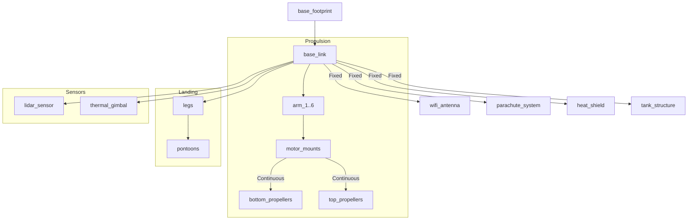

# 🚁 **Hydro-Ring: Autonomous Amphibious Wildfire Suppression Drone**

### *High-Speed | Swarm AI | Fireline Intelligence | Distributed Autonomy*

Hydro-Ring is an advanced autonomous UAV platform designed for rapid-response wildfire suppression. Unlike traditional firefighting drones that carry water as an external payload, Hydro-Ring integrates its water reservoir directly into its **toroidal body structure**, dramatically improving aerodynamic stability, maneuverability, and endurance.

---

# 📘 **1. Introduction**

Wildfires have increased in frequency and severity across the world due to rising temperatures, drought, and shifting climate patterns. Effective early intervention is crucial to minimizing ecological damage and economic loss.

Current suppression systems (helicopters, tankers, conventional drones) suffer from high operational cost, slow deployment, and inefficient water delivery.

The Hydro-Ring project addresses this with a set of engineering objectives:

* Treat water as a **structural component**, not external cargo
* Enable rapid, energy-efficient amphibious water refill
* Perform **autonomous, fire-aware route planning**
* Execute **distributed task allocation** via swarm intelligence
* Provide a robust, modular, high-speed aerial unit for real-time wildfire response

---

# 🎓 **2. Design Philosophy**

Hydro-Ring is based on four core engineering principles:

---

## **2.1. Structural–Fluid Integration**

By embedding the water reservoir within the ring-shaped body:

* Sloshing is minimized
* Moment distribution becomes uniform
* Center of gravity remains stable
* Aerodynamic agility increases substantially

---

## **2.2. Distributed Autonomy & Swarm Intelligence**

The system is not dependent on a single commander. Drones continuously exchange:

* Local fire maps
* Battery and water level
* Position & velocity
* Hazard zones
* Route bottlenecks

They collaboratively reach consensus and distribute tasks dynamically.

---

## **2.3. Amphibious Efficiency**

Instead of hovering to refill with pumps (high energy loss), Hydro-Ring **lands on water sources**, enabling:

* Lower power consumption
* Fast and stable refilling
* Minimal hover time

---

## **2.4. Fire-Dynamics–Aware Routing**

Route planning incorporates environmental and thermal factors:

* Wind vectors
* Flame intensity
* Smoke opacity
* Fireline boundaries
* Hotspot propagation

This enables safe navigation and optimized attack vectors.

---

# ⚙️ **3. Mechanical System Overview**

---

## **3.1. Toroidal Water Tank Structure**

* One-piece hexagonal torus
* Distributed internal baffling
* Impact-resistant composite shell
* Designed to maintain aerodynamic symmetry

---

## **3.2. 12-Rotor Coaxial Propulsion System**

* High thrust-to-weight ratio
* Redundant rotor pairs
* Symmetric lift distribution
* Advanced noise-aware RPM modulation

---

## **3.3. Amphibious Landing + Pump System**

* Stable water-surface landing
* High-flow refill pump
* Flow rate & volume sensors
* Auto-complete refill algorithm

---

## **3.4. 360° Directional Water Discharge System**

* Controllable segmented spray nozzles
* Adjustable spray pressure
* Perimeter-based suppression
* Intelligent water-usage optimization

---

# 🔥 **4. Thermal Protection & Fire Safety**

* Gold-coated thermal bottom shield
* Carbon-composite insulation layers
* Battery thermal isolation
* Automatic retreat mode under extreme heat
* Emergency parachute system

---

# 🧠 **5. Sensor Architecture**

---

## **5.1. Thermal Camera Module**

* 30–50 FPS thermal feed
* Hotspot segmentation using CNN
* Fireline contour extraction

---

## **5.2. 3D LIDAR Mapping**

* Real-time point cloud generation
* Smoke-penetrating compensation filters
* Flame height estimation

---

## **5.3. Multi-Sensor Fusion**

* EKF-based fusion
* Thermal + LIDAR + IMU integration
* Latency compensation

---

# 🧭 **6. Autonomous Route Planning**

Hydro-Ring uses a hybrid algorithm stack:

* **Fire-Aware A*** (cost-weighted thermal avoidance)
* **RRT*** for dynamic obstacle clearance
* **MPC** for maneuver optimization
* **Potential Field** for fire-zone repulsion
* **Thermal Gradient Tracking** for hotspot localization

Routes update every **200–300 ms** depending on fire behavior.

---

# 🤖 **7. Swarm Intelligence**

---

## **7.1. Distributed Task Allocation**

Each drone broadcasts:

* Battery status
* Water level
* Proximity to fire
* Local hazard map
* Speed & position

Task allocation uses **auction-based selection** and **consensus voting**.

---

## **7.2. Role Specialization**

* **Attack Units** → direct suppression
* **Support Units** → mapping, scanning
* **Supply Units** → shuttle refill cycles
* **Reserve Units** → switching, fallback

---

## **7.3. Swarm Behaviors**

* Flocking
* Anti-collision
* Shared fire map
* Dynamic merge & split
* Distributed leader election

---

# 🔄 **8. System Architecture (URDF)**

(Kept identical for simulation and robotics workflows)

---

# 🧪 **10. Engineering & Academic Analysis**

---

## **10.1. CFD Analysis**

* Vertical plume interaction with rotor downwash
* Smoke density effects on airflow
* Wake interference
* Hot-air turbulence response

---

## **10.2. FEA Structural Analysis**

* Reservoir pressure distribution
* Rotor torque effects
* Thermal deformation
* Material fatigue under cyclic heating

---

## **10.3. Battery Thermal Management**

* Cell temperature profiles
* Thermal runaway prevention
* Passive airflow channels
* Emergency venting system

Engineered By Furkan Can İsci
